# procedural-wallpapers in Rust
A collection of wallpaper generators.
Based on a fork of [bagyoni](https://github.com/bagyoni/procedural-wallpapers)s procedural wallpapers project in C++ ([link](https://github.com/lukas-kirschner/procedural-wallpapers)).
Rewritten in Rust.

## How to use
1. Set up your Rust toolchain with Cargo
2. Clone this repository
3. Build the project by typing `cargo build --release` 
4. To get command-line help, run the build binary with the `--help` flag.

### Command-Line options
```text
procedural_wallpapers 0.1.0
Generate wallpapers procedurally with the given algorithm

USAGE:
    procedural_wallpapers [OPTIONS] --mode <MODE> --output <OUTPUT>

OPTIONS:
    -h, --height <HEIGHT>    Desired height (pixels) of the generated image [default: 1080]
        --help               Print help information
    -m, --mode <MODE>        Image generation mode [possible values: clouds]
    -o, --output <OUTPUT>    The output file to save
    -s, --seed <SEED>        Seed for the random number generator. If a seed of 0 is given, no seed
                             is used [default: 0]
    -V, --version            Print version information
    -w, --width <WIDTH>      Desired width (pixels) of the generated image [default: 1920]

```

## Generators and examples

All the example images shown below were generated with a size of `400`x`400` pixels and a seed of `123456`.
They can be automatically re-generated by running `make thumbnails` in the project directory.

<table width="100%">
<tr>
	<td width="50%">
		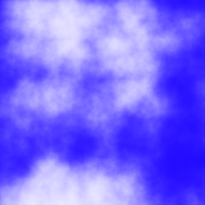
		<b>Clouds</b>
		<p>Perlin noise fed into a sigmoid function.
	</td>
	<td width="50%">
		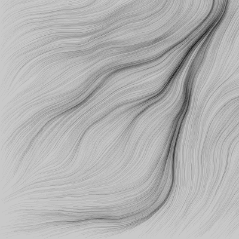
		<b>Flow</b>
		<p>Perlin flow field.
	</td>
</tr>
<tr>
	<td width="50%">
		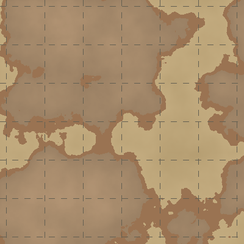
		<b>Islands</b>
		<p>Perlin noise fed into a cutoff function.
	</td>
	<td width="50%">
		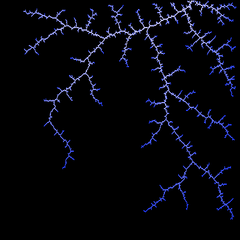
		<b>Lightning</b>
		<p>Similar to a Brownian tree but faster to generate.
	</td>
</tr>
<tr>
	<td width="50%">
		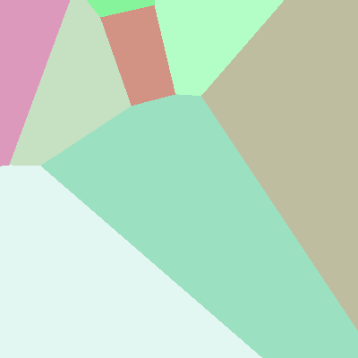
		<b>Nearest-Point</b>
		<p>Each Pixel gets the color of its nearest point neighbor.
	</td>
	<td width="50%">
		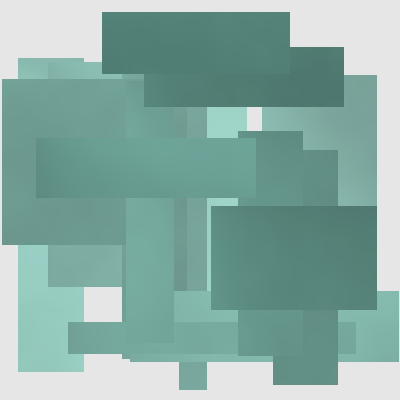
		<b>Tangles</b>
		<p>Rec-tangles.
	</td>
</tr>
<tr>
	<td width="50%">
		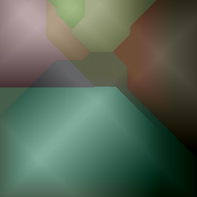
		<b>Cellular One</b>
		<p>Each pixel is colored based on a cellular automaton that colors each pixel according to the average value of each neighbor color, starting with random pixels at random locations.</p>
	</td>
	<td width="50%">
		
		<b>Squares</b>
		<p>The algorithm starts in the upper left corner of the image, coloring a square in a random color. Then, each pixel, from left-to-right, top-to-bottom gets assigned the average color of neighboring pixels plus a random offset.</p>
	</td>
</tr>
<tr>
	<td width="50%">
		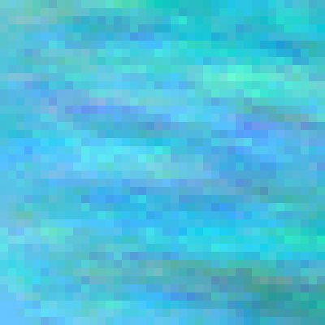
		<b>Horizontal Squares (SquaresHor)</b>
		<p>The Squares algorithm, prioritizing squares that are located above each pixel</p>
	</td>
	<td width="50%">
		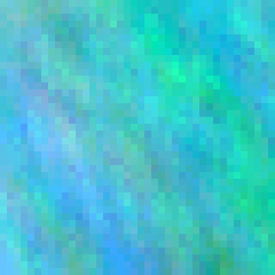
		<b>Vertical Squares (SquaresVer)</b>
		<p>The Squares algorithm, prioritizing squares that are located left of each pixel</p>
	</td>
</tr>
<tr>
	<td width="50%">
		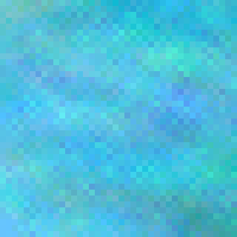
		<b>Diagonal Squares (SquaresDiag)</b>
		<p>The Squares algorithm, prioritizing squares that are located above left of each pixel</p>
	</td>
	<td width="50%">
		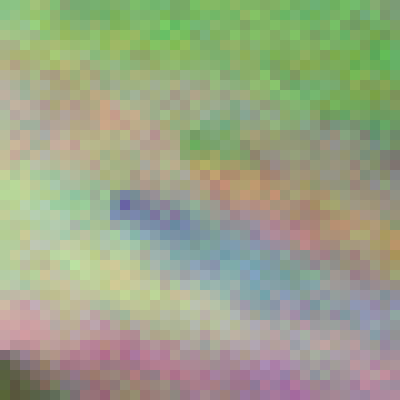
		<b>Squares with random pixels (Squares2)</b>
		<p>The Squares algorithm, with more initial pixels that have a random color assigned in the middle of the image</p>
	</td>
</tr>
</table>